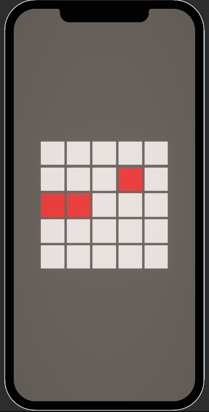
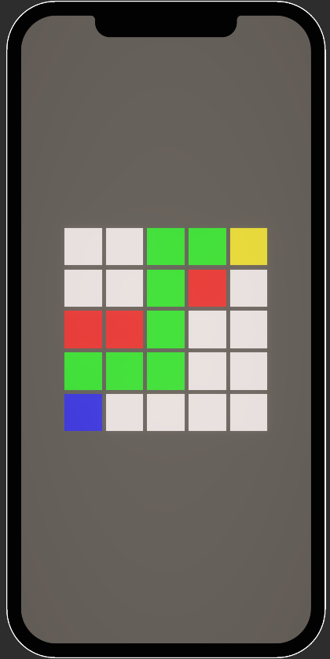
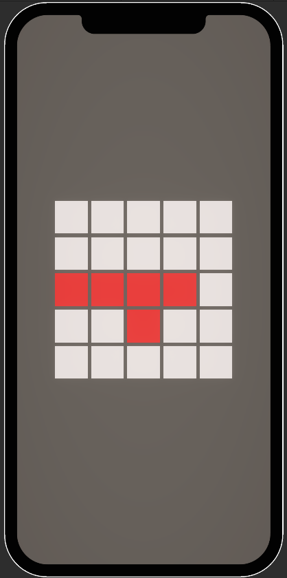
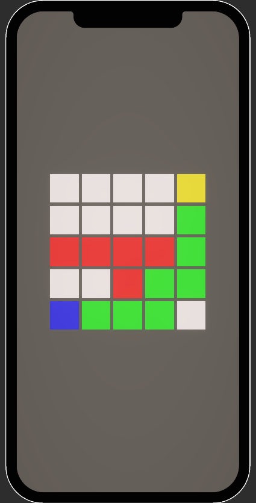

# A* Pathfinding System

A simple, clean and reusable A* pathfinding implementation in Unity.

## Features
- Grid-based pathfinding system
- Visual node representation
- Dynamic obstacle placement
- Auto-adjusting camera
- Runtime grid size modification

## Screenshots

### Obstacles

### Path Finding

### Different Obstacles

### Path Finding

## How It Works
- Uses A* algorithm for finding the shortest path
- Supports walkable/unwalkable nodes
- Visual feedback for path, obstacles, start and end points
- Color coding:
  - White: Walkable nodes
  - Red: Obstacles
  - Green: Path
  - Blue: Start point
  - Yellow: End point

## Usage
1. Add GridVisualizer to an empty GameObject
2. Set up the grid size and node prefab
3. Add CameraController to your main camera
4. Configure start/end positions and obstacles
5. Click "Find Path" to visualize the path
 
